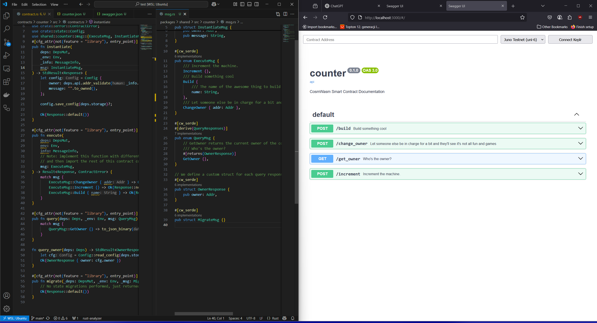

# CosmWasm Swaggy

A tool designed to make documenting your CosmWasm Smart Contract easier. Generate the documentation for your contract ***with a single command!***

It can generate OpenAPI spec for your smart contracts, as well as display the docs in the browser. Did we mention that the docs are interactive and all methods can be called visually with your Keplr wallet? 



## Install

To install `cw-swaggy`, you can download it from the crates.io repository:

```sh
cargo install cw-swaggy
```

## The Problem

Usually in enterprise environment, it is very important to have an up-to-date documentation for projects. There's two main reasons for that:

1. Being able to show work progress on backend components of the system to non-technical people, which also includes demo-ing the product to the client or investors, as well as allowiing the QA team to interact with the backend in a straightforward way
2. Providing a guideline for the frontend team, which helps with integrating backend services into the end product.

In this case, we are treating blockchain smart contracts as a backend for a DApp, as that is essentially what they are in practice.

## The Solution

Swagger UI and OpenAPI standard is widely used for APIs and backend documentation/testing in Web2, but we don't currently have a similar solution for Web3. As such, why reinvent the wheel, when we can repurpose the tools that people are already familiar with for the new needs? 

That is the goal of CosmWasm Swaggy - ***to bring Swagger UI with all of its features to the Cosmos Ecosystem.***

## Swaggy in Practice

The goal of the project is to allow for the following operations on CosmWasm smart contracts:

* Documentation of all major endpoints that a contract exposes publically: `Instantiate`, `Execute` messages, and `Query` messages
* Support for executing each message according to schema defined in the CW project - query and publish tx to the chain through Swagger
* Provide the option to adjust the network (mainnet, testnet, localhost, etc) and a chain selector

## Usage

`swaggy` is currently able to run two subcommands

```
Usage: swaggy <COMMAND>

Commands:
  build  Build a swagger.json file from the contract schema
  serve  Serve the swagger spec
  help   Print this message or the help of the given subcommand(s)

Options:
  -h, --help  Print help
  ```

  * `build` creates an openAPI-compatible file with special metadata that describes all functions of the contract
  * `serve` starts an HTTP server at `localhost` that displays the spec as fully graphical documentation

  